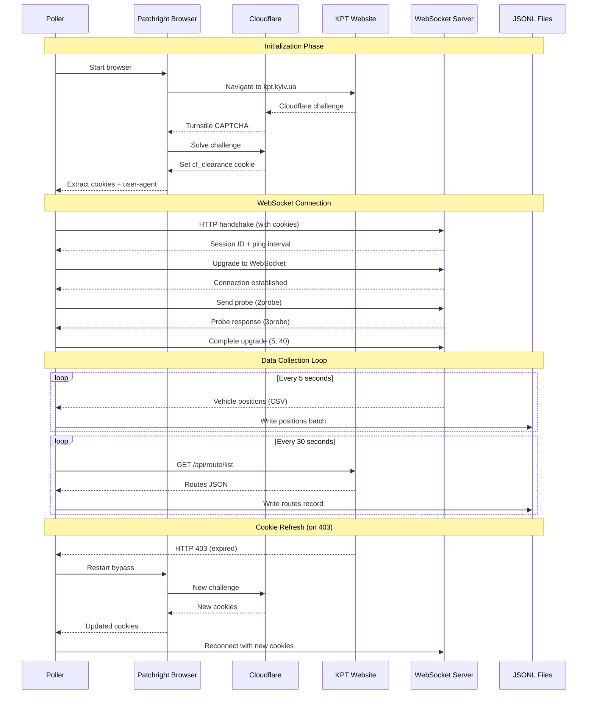

# KPT Poller Pipeline

## Overview

Interceptor for KPT (Kyiv Public Transport) - REST API for route list + real-time positions from WebSocket.

## Architecture

## Data Flow

1. **Cloudflare Bypass** - Patchright to solve Turnstile CAPTCHA
2. **Cookie Extraction** - `cf_clearance` cookie - API access
3. **WebSocket Connect** - Socket.IO handshake + session ID
4. **Position Streaming** - Read real-time data in CSV
5. **Route Polling** - Periodic REST API calls - routes list

## Message Format

Vehicle position CSV: `vehicle_id,route_id,lat,lon,direction,flag,timestamp`
Example: `12585093,12583358,50.50963,30.64338,0,0,1769342268`

## Output Streaming

- `kpt_positions_YYYYMMDD.jsonl` - Vehicle positions
- `kpt_routes_YYYYMMDD.jsonl` - Route metadata
